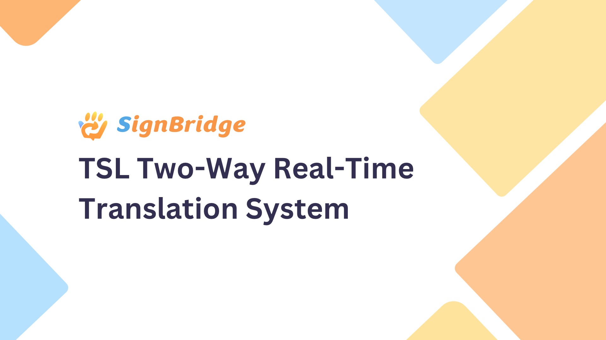

# SignBridge

<p align="center">
  <a href="README.md">English</a> | <b>繁體中文</b>
</p>

<p align="center">
  
</p>

SignBridge 是一款專為「台灣手語（Taiwanese Sign Language, TSL）」打造的雙向即時溝通應用系統。本專案整合 Flutter 行動應用端、手語詞即時影像辨識、Google Gemma 生成式語言模型、檢索增強生成（RAG）以及 3D 手語虛擬人動作合成，致力於消除聽障者與健聽人士之間的溝通藩籬。

## 核心功能

- **文字轉手語**：將繁體中文或多語言輸入轉譯為符合台灣手語文法之詞彙序列（Gloss），並於 3D 虛擬人偶上即時串接播放對應動作。
- **手語轉文字**：透過手機鏡頭即時擷取並辨識使用者手語動作，提供候選詞檢視與確認機制，協助組合成完整手語句。
- **AI 語序轉譯**：採用 Gemma 語言模型將確認後的手語詞彙倒裝序列，重構成通順自然的繁體中文語句。
- **即時對話聊天室**：支援建立與加入即時對話房間，跨端雙向同步文字訊息、手語辨識結果與 3D 手語動畫。
- **語音輔助功能**：支援語音辨識輸入與文字轉語音（TTS）播報，提供更便捷的多模態互動。
- **多國語言支援**：自動偵測非中文輸入並轉譯為繁體中文後，進一步生成台灣手語對應輸出。

## 系統架構

```text
Flutter App (行動端應用)
   │
   ▼
Main API (FastAPI 主後端服務，連接埠 8000)
   ├── 手語詞即時辨識 (MediaPipe + ST-GCN)
   ├── 即時對話房間與 WebSocket 雙向通訊
   ├── GLB 3D 手語動作選取、動態拼接與快取
   └── Gemma API 客戶端串接
             │
             ▼
       Gemma RAG API (語言模型服務，連接埠 8001)
          ├── Google Gemma 4 語言模型
          ├── Sentence Transformers 語意向量模型
          └── PostgreSQL + pgvector 向量資料庫
```

## 技術技術堆疊

- 行動端應用：Flutter / Dart
- 主後端服務：Python 3.10, FastAPI, MediaPipe, PyTorch, OpenCV
- 手語辨識架構：時空圖卷積神經網路（Spatial-Temporal Graph Convolutional Network, ST-GCN）
- 生成式 AI 轉譯：Google Gemma 4, Transformers, BitsAndBytes 量化推論
- 檢索增強生成（RAG）：Sentence Transformers, PostgreSQL, pgvector
- 動作資產處理：glTF / GLB, `pygltflib`
- 即時通訊協定：WebSocket

## 專案目錄結構

```text
SignBridge/
├── frontend/                             # Flutter 行動端應用程式
├── sign_recognition/                     # 手語辨識服務轉接模組
├── TSL-translator-real-time-recognition/ # ST-GCN 模型與特徵管線
├── Gemma4-TSL-RAG/                       # Gemma 語意轉譯與 RAG 服務 API
├── adjusted_actions/                     # GLB 3D 手語骨架動作資產庫
├── tests/                                # 後端與 WebSocket 整合測試
├── main.py                               # FastAPI 主服務入口
├── merge_glb.py                          # 3D GLB 動作拼接器
├── requirements.txt                     # 主後端相依套件清單
├── start-backend.ps1                    # Windows 後端一鍵啟動腳本
└── stop-backend.ps1                     # Windows 後端停止腳本
```

## 開源模型發布與合規聲明 (Open Source Releases & Compliance)

為響應數位發展部數位產業署推動開源 AI 之精神，本專案所有核心模型、特徵規格與標註均以公開透明方式釋出於全球機器學習平台 Hugging Face：

### Hugging Face 開源資產
- **手語詞辨識模型 (ST-GCN)：**
  - 儲存庫網址：[`dYang1/SignBridge-TSL-STGCN`](https://huggingface.co/dYang1/SignBridge-TSL-STGCN)
  - 授權條款：Apache License 2.0
  - 涵蓋資產：完整訓練權重 (`best_model.pt`)、模型網路定義 (`model.py`)、骨架圖拓撲 (`graph.py`)、特徵提取前處理模組 (`extract.py`)。
- **台灣手語骨架座標特徵資料集：**
  - 儲存庫網址：[`dYang1/SignBridge-TSL-Landmarks`](https://huggingface.co/datasets/dYang1/SignBridge-TSL-Landmarks)
  - 授權條款：創用 CC 姓名標示 4.0 國際版 (CC-BY-4.0)
  - 涵蓋資產：55 節點骨架時序特徵向量與台灣手語詞彙標註映射檔。

### 來源揭露與非中資合規切結
1. **自主研發**：本專案使用之 ST-GCN 手語識別模型，其網路拓撲、訓練流程與權重檢查點均由台灣團隊自主研發並於本地完成訓練，不依賴任何中國大陸來源或受限實體之預訓練模型。
2. **語料在地化**：辨識資料集全數採集自台灣手語（TSL）語法與日常生活對話，具備完整合法授權。
3. **國際通用授權**：程式碼與模型權重採 Apache-2.0 釋出，資料集採 CC-BY-4.0 釋出，完全符合開源競賽與資通安全查核規範。

## 系統環境需求

- 作業系統：Windows 10 或 Windows 11
- 主後端環境：Python 3.10
- Gemma RAG 服務環境：Python 3.12
- 行動端環境：Flutter SDK 3.x
- 資料庫：PostgreSQL（需安裝 pgvector 擴充套件）
- 硬體加速：具備 NVIDIA CUDA 支援之 GPU（用於 4-bit Gemma 模型推論）
- 測試設備：Android 實體手機或 Android 模擬器
- 外部帳號：具備 Gemma 模型存取權限之 Hugging Face 帳號

## 安裝步驟

### 1. 複製專案庫

```powershell
git clone https://github.com/Blaire0228/SignBridge.git
cd SignBridge
```

### 2. 建立主後端虛擬環境

```powershell
py -3.10 -m venv venv
.\venv\Scripts\Activate.ps1
python -m pip install --upgrade pip
pip install -r requirements.txt
```

### 3. 建立 Gemma RAG 虛擬環境

```powershell
cd Gemma4-TSL-RAG
py -3.12 -m venv .venv
.\.venv\Scripts\Activate.ps1
python -m pip install --upgrade pip
pip install -r requirements.txt
cd ..
```

注意：PyTorch 套件需視您的 GPU 與 CUDA 驅動版本而定。若預設安裝未能啟動 GPU 加速，請參考 [PyTorch 官方安裝指南](https://pytorch.org/get-started/locally/) 重新安裝對應版本。

### 4. 設定環境變數

```powershell
Copy-Item .\Gemma4-TSL-RAG\.env.example .\Gemma4-TSL-RAG\.env
```

編輯 `Gemma4-TSL-RAG/.env` 檔案：

```dotenv
HF_TOKEN=your_hugging_face_token
DB_PASSWORD=your_postgresql_password
```

### 5. 配置 PostgreSQL 資料庫

建立資料庫：

```sql
CREATE DATABASE tsl_rag_system;
```

連線至 `tsl_rag_system` 資料庫後，建立 pgvector 擴充與資料表：

```sql
CREATE EXTENSION IF NOT EXISTS vector;

CREATE TABLE tsl_knowledge (
    id bigserial PRIMARY KEY,
    book_name varchar(50),
    unit_name varchar(100),
    pattern_no integer,
    description text,
    logic_structure text,
    chinese_sentence text,
    tsl_markup text,
    embedding vector(384)
);

CREATE TABLE tsl_general_corpus (
    id bigserial PRIMARY KEY,
    chinese_text text,
    tsl_text text,
    embedding vector(384)
);
```

### 6. 安裝 Flutter 相依套件

```powershell
cd frontend
flutter pub get
cd ..
```

## 啟動後端服務

確認 PostgreSQL 服務運作中，且兩組 Python 虛擬環境皆已配置完成後，執行：

```powershell
.\start-backend.ps1
```

預設服務位址：

- 主後端 API：`http://127.0.0.1:8000`
- 主後端 API 文件：`http://127.0.0.1:8000/docs`
- Gemma RAG API：`http://127.0.0.1:8001`
- Gemma RAG API 文件：`http://127.0.0.1:8001/docs`

停止後端服務：

```powershell
.\stop-backend.ps1
```

## 啟動 Flutter 行動端

### Android 模擬器

Android 模擬器可透過預設之 `http://10.0.2.2:8000` 連線至主機後端：

```powershell
cd frontend
flutter run
```

### Android 實體裝置（USB 連線）

請開啟手機的「開發人員選項」與「USB 偵錯」，並執行：

```powershell
& "$env:LOCALAPPDATA\Android\Sdk\platform-tools\adb.exe" reverse tcp:8000 tcp:8000
cd frontend
flutter run --dart-define=API_BASE_URL=http://127.0.0.1:8000
```

### Android 實體裝置（區域 Wi-Fi 網路連線）

請確認 Windows 防火牆允許通過 TCP 8000 連接埠，並將 `<YOUR_PC_LAN_IP>` 替換為後端主機的區域網路 IP：

```powershell
cd frontend
flutter run --dart-define=API_BASE_URL=http://<YOUR_PC_LAN_IP>:8000
```

注意事項：請勿將臨時穿透網址或個人網路位址寫死於程式碼中，建置時請一律透過 `API_BASE_URL` 注入端點位址。

## 開源授權與第三方聲明

本專案核心原始碼依 Apache License 2.0 條款授權發布。

Google Gemma 模型之使用與再散布規範，請遵循 Google Gemma Terms of Use。

## 引用來源與學術參考 (Citations & References)

若於研究或專案中使用本專案之架構或依賴模組，請引用以下項目：

```bibtex
@misc{gemma20264,
  title={Gemma 4: Open Multimodal Language Models},
  author={Gemma Team},
  year={2026},
  publisher={Google DeepMind},
  howpublished={\url{https://ai.google.dev/gemma/docs/core/model_card_4}}
}

@software{SignBridge_TSL_STGCN_2026,
  author = {SignBridge Development Team},
  title = {SignBridge-TSL-STGCN: Taiwanese Sign Language Recognition via ST-GCN},
  year = {2026},
  publisher = {Hugging Face},
  howpublished = {\url{https://huggingface.co/dYang1/SignBridge-TSL-STGCN}}
}
```

## 開發成員與貢獻者

- [@Blaire0228](https://github.com/Blaire0228)
- [@defyingYang](https://github.com/defyingYang)
- [@Tobermory0927](https://github.com/Tobermory0927)
- [@CHIEH1111](https://github.com/CHIEH1111)
- [@xuanx0701](https://github.com/xuanx0701)
